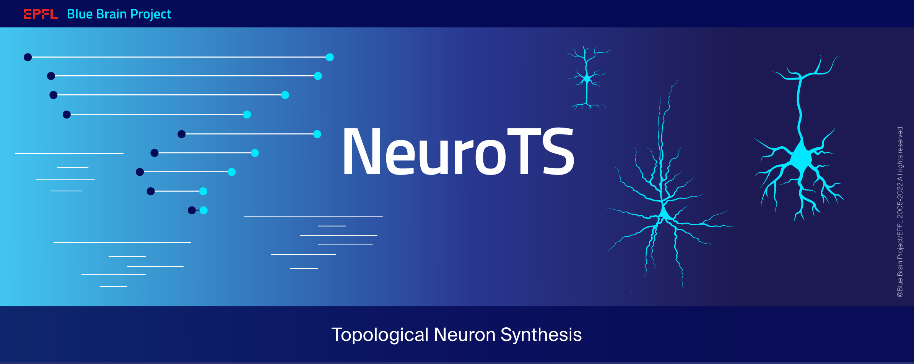

[](https://github.com/BlueBrain/NeuroTS/releases)
[](https://github.com/BlueBrain/NeuroTS/actions)
[](https://codecov.io/github/BlueBrain/NeuroTS?branch=main)
[](https://github.com/psf/black)
[](https://github.com/BlueBrain/NeuroTS/blob/main/LICENSE.txt)
[](https://neurots.readthedocs.io/)
[](https://doi.org/10.1101/2020.04.15.040410)


# NeuroTS

Generation of artificial neuronal trees based on the topology of biological cells and their
statistical properties.


## Installation

It is recommended to install ``NeuroTS`` using [pip](https://pip.pypa.io/en/stable/):

```bash
pip install neurots
```

## Main usage


## Examples


## Funding & Acknowledgment

The development of this software was supported by funding to the Blue Brain Project, a research center of the École polytechnique fédérale de Lausanne (EPFL), from the Swiss government’s ETH Board of the Swiss Federal Institutes of Technology.

For license and authors, see `LICENSE.txt` and `AUTHORS.md` respectively.

Copyright © 2021 Blue Brain Project/EPFL
